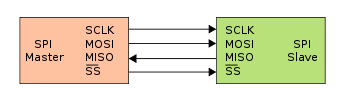
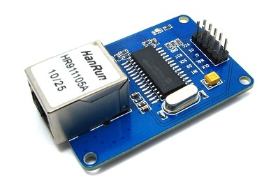

## Comunicaciones Serie

El protocolo de comunicaciones más sencillo es que ya hemos usado: el protocolo serie.

La forma natural de comunicarse con Arduino es utilizando el puerto serie, siendo este el método de depuración más usado.
En el [siguiente vídeo](https://youtu.be/A6BH4cfqS4k) veremos detalles sobre este protocolo, cómo usarlo en Arduino y cómo leer datos desde Arduino.

Actualización: en el vídeo no aparecen los métodos readString y readStringUntil, muy útiles de la librería Serial. Nos facilitan enormemente el recuperar cadena desde el puerto serie.

Os dejo una presentación donde se trata en más detalle "Tema 10 - Comunicaciones serie.pdf"

## Comunicaciones bluetooth

Una vez podemos comunicarnos vía puerto serie el pasar a comunicaciones inalámbricas es  sencillo con bluetooth.

Existen unos dispositivos capaces de enviar al dispositivo con el que están emparejados los datos que ellos reciben por sus pines.

En esta imagen podemos ver uno de ellos. Bajo este aspecto existen diferentes tipos de dispositivos. 
Para hacer lo que pretendemos basta la versión más básica, que será un bluetooth de tipo esclavo (los master pueden costar hasta 4 veces más)

La conexión con Arduino es muy sencilla (sólo hay que tener en cuenta que hay que conectar con los cables cruzados: TX-RX y RX-TX)

En el [siguiente vídeo](https://youtu.be/N04DzxnTXqA) vemos cómo utilizarlos y configurarlos

En el [siguiente vídeo](https://youtu.be/j5j-pfIGdoM) vamos a usar un dispositivo bluetooth para activar un rele remotamente desde un móvil

## Procotocolos de comunicaciones

En el [siguiente vídeo](https://www.youtube.com/embed/DePCak9WNPM) hablaremos sobre algunos de los protocolos de comunicaciones más usados, como son I2C y SPI.

La presentación está disponible en el fichero "Tema 10 - Protocolos de comunicaciones.pdf"

### Pines SPI

¿Dónde están los pines SPI en las distintas placas?

Uno de los protocolos de comunicaciones más usados en Arduino es el SPI. Se utiliza para comunicarse con multitud de dispositivos. Cómo norma general, la manera más sencilla de encontrar los pines SPI es en el conector ICSP. Algunas placas los duplican entre los pines digitales, pero otras no.

|Placa| SCK|MOSI|MISO
|---|---|---|---
|Arduino UNO|D13|D11|D12
|Arduino Leonardo|D3|D4|D1
|Arduino Mega|D52|D51|D50

## Ethernet

Si de verdad queremos comunicar nuestro proyecto con internet necesitamos un shield ethernet.

Existen básicamente dos tipos de shields, los basados en el chip Wiznet W5100 

[Ethernet_5100.png](./images/Ethernet_5100.png)

y en la librería  Ethernet de  Arduino’s IDE  (cuya documentación podemos encontrar http://arduino.cc/en/Reference/Ethernet) y los basados en el chip enc28J60 http://www.microchip.com/wwwproducts/Devices.aspx?dDocName=en022889   

y que utilizan la librería ethercard https://github.com/jcw/ethercard (de JeeLabs).

Las dos admiten esencialmente la misma funcionalidad y se conectan a Arduino por SPI. Sin embargo la diferencia de coste es sorprendente. ¿A qué se debe?:

A que el Wiznet W5100 incluye el stack TCP-IP completamente en hardware mientras que en el enc28J60 es necesario que nuestro microcontrolador realice todas las operaciones por software. Es decir el W5100 libera a nuestro micro de la mayor parte del trabajo duro del acceso a internet, mientras que con el enc28J60, tiene que sufrirlo entero.

Por tanto si tenemos que realizar un proyecto donde se usará mucho acceso a internet claramente necesitaremos la solución hardware.

En [este vídeo](https://youtu.be/s8D1DZWbubg) vamos a ver los detalles de como usar cada uno de ellos.

En el [siguiente vídeo](https://youtu.be/6W_2I--XwrY) comentamos el hardware necesario para comunicarnos por internet
